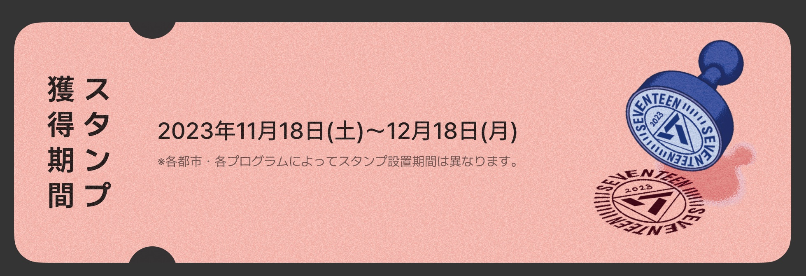
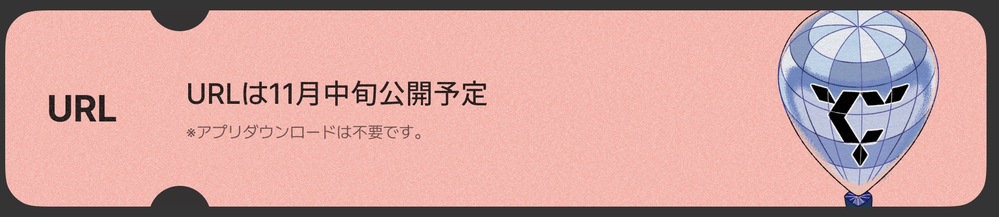
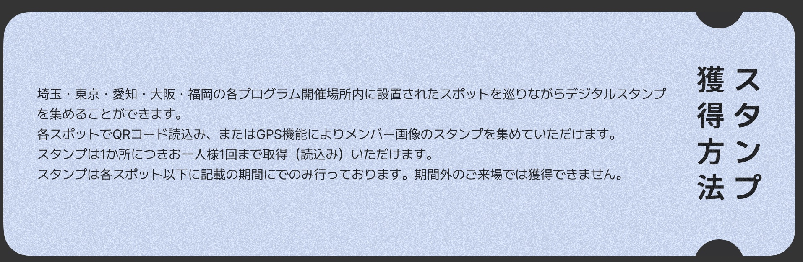
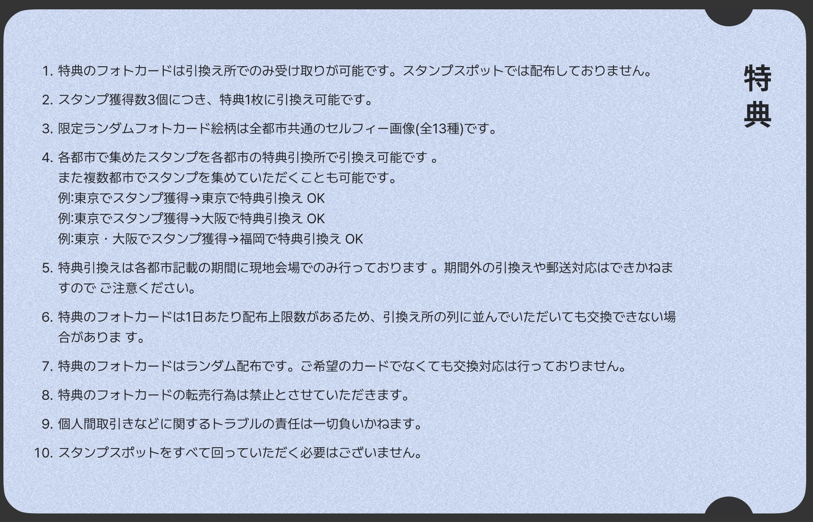
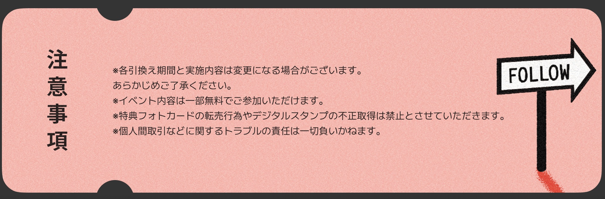

# SEVENTEEN FOLLOW THE CITY

## RALLY

> **获得期间**

+ 2023.11.18 ~ 2023.12.18
+ 各地设置时间不同

> **URL**

+ 11 月中旬公开

+ 获得方法
  + 在各个城市指定地点收集数字图章，1 个地点每人最多获得一次图章。只有在限定期间内可以获得。

> **特典**

+ 特典只能到兑换处领取，印章点不发放
+ 每 3 个印章，可以兑换一个特典（13 随 1）
+ 特典为自拍卡（全 13 种）
+ 在各个城市收集的图章，可以在各个城市兑换
  + 也可以在多个城市收集图章，如：
    + 在东京获得图章 -> 在东京兑换特典 ⭕️
    + 在东京获得图章 -> 在大阪兑换特典 ⭕️
+ 特典兑换只在当地规定期限内进行
+ 特典每天有分发上限

### Schedule

### Schedule

#### SAITAMA / TOKYO 埼玉 / 东京

**地点**：尚未公布

**时间**：11.22 WED - 11.26 SUN

\**注：埼玉有集邮处但没有兑换处*

**SPOT**

+ 免费（7）
  + 西武巨蛋（11.18 SAT - 12.18 MON）
  + UNITED CINIMAS 原创拍照点
  + UNITED CINIMAS 
+ 付费（7）
  + BOX cafe * 4
  + PHOTO EXIHIBITION
    + 会場：hmv museum 渋谷6
    + 日程：2023年11月18日（土）～12月3日（日）
    + 営業時間：11:00～20:30 ※入場は20:00まで
    + 入場料：1,000円（税込）
  + PHOTO EXIHIBITION 大宫 shop
    + 明信片 2枚（全13種）：700円（税込）
    + 透明海报（？）（全14種）：1,100円（税込）
  + NIGHT AQUARIUM

#### AICHI

#### OSAKA

#### FUKUOKA

**地点**：尚未公布

**时间**：12.15 FRI - 12.18 MON

**SPOT**

+ 免费（8）

  + UNITED CINEMAS
    + 拍照点：福岡ももち

  + JET

+ 付费（4）

  + BOX cafe&space 博多マルイ店
    + 时间：11.23 THU - 12.18 MON（集邮）
    + 价格：800円(税込880円)
  + POP-UP STORE
    + 时间：12.09 SAT - 12.17 SUN
    + 営業時間：平日11:00～20:00／土日10:00～20:00
    + 地点：【福岡】ソラリアプラザ 3F (福岡市中央区天神2丁目2-43)

## POP-UP STORE

### 爱知

開催期間：2023年11月23日(木・祝)～2023年12月3日(日)

開催場所：【愛知】名古屋PARCO 東館2Fイベントスペース (愛知県名古屋市中区栄3-29-1)

　　　　　　https://nagoya.parco.jp/

営業時間：全日 10:00～21:00

### 大阪

開催期間：2023年12月2日(土)～2023年12月10日(日)

開催場所：【大阪】心斎橋オーパ 4F (大阪府大阪市中央区西心斎橋1-4-3)

　　　　　　https://www.opa-club.com/shinsaibashi

営業時間：全日 11:00～21:00

### 福冈

開催期間：2023年12月9日(土)～2023年12月17日(日)

開催場所：【福岡】ソラリアプラザ 3F (福岡市中央区天神2丁目2-43)

　　　　　　https://www.solariaplaza.com/

営業時間：平日11:00～20:00／土日10:00～20:00

### 販売商品

+ PHOTO CARD(RANDOM) 小卡

+ INSTANT PHOTO STICKER CARD(RANDOM) 拍立得
+ IMAGE PICKET
  + (S.COUPS/JEONGHAN/JOSHUA/JUN/HOSHI/WONWOO/WOOZI/THE8/MINGYU/DK/SEUNGKWAN/VERNON/DINO)
+ MINI PICKET KEYRING
  + (S.COUPS/JEONGHAN/JOSHUA/JUN/HOSHI/WONWOO/WOOZI/THE8/MINGYU/DK/SEUNGKWAN/VERNON/DINO)
+ ACRYLIC STAND 立牌
  + (S.COUPS/JEONGHAN/JOSHUA/JUN/HOSHI/WONWOO/WOOZI/THE8/MINGYU/DK/SEUNGKWAN/VERNON/DINO)
+ CAN BADGE(RANDOM)
+ TAPESTRY
  + (S.COUPS/JEONGHAN/JOSHUA/JUN/HOSHI/WONWOO/WOOZI/THE8/MINGYU/DK/SEUNGKWAN/VERNON/DINO)

+ FOLLOW THE LIGHT KEYRING(RANDOM) 钥匙扣？
+ MUFFLER TOWEL 手幅
  + (SEVENTEEN/S.COUPS/JEONGHAN/JOSHUA/JUN/HOSHI/WONWOO/WOOZI/THE8/MINGYU/DK/SEUNGKWAN/VERNON/DINO)

+ SHOULDER STRAP 肩带（？）
  + (SEVENTEEN/S.COUPS/JEONGHAN/JOSHUA/JUN/HOSHI/WONWOO/WOOZI/THE8/MINGYU/DK/SEUNGKWAN/VERNON/DINO)

+ PHOTO CARD HOLDER 
  + (HIP HOP(PINK)/VOCAL(WHITE)/PERFORMANCE(BLUE))

+ PHOTO CARD BINDER

+ S/S T-SHIRT WHITE(M/L) T恤

+ S/S T-SHIRT BLACK(M/L)

+ L/S T-SHIRT(M/L)

+ ZIP-UP HOODIE(M/L)

+ TOTE BAG(WHITE/BLACK) 托特包

+ BONGBONGEE T-SHIRT(M/L)

+ BONGBONGEE FLUFFY BAG

+ BONGBONGEE PICKET CASE

+ BONGBONGEE MULTI CLIP

+ BONGBONGEE SMARTPHONE BAND

+ PINS(AICHI/OSAKA/FUKUOKA)

  ※各POP-UP開催都市のPINSのみ販売を予定しております

## PHOTO EXHIBITION

### 东京
会場：hmv museum 渋谷6（「[HMV&BOOKS SHIBUYA](https://www.hmv.co.jp/store/BTK/)」 6F）
日程：2023年11月18日（土）～12月3日（日）
営業時間：11:00～20:30 ※入場は20:00まで

### 名古屋
会場：hmv museum 栄（「[HMV栄](https://www.hmv.co.jp/store/SAK/)」店内） 
日程：2023年11月18日（土）～12月4日（月）
営業時間：11:00～20:30 ※入場は20:00まで

### 大阪
会場：hmv museum 心斎橋（「[HMV&BOOKS SHINSAIBASHI](https://www.hmv.co.jp/store/BSB/)」店内）
日程：2023年12月2日（土）～12月17日（日）
営業時間：11:00～20:30 ※入場は20:00まで

### 福冈
会場：hmv museum 博多（「[HMV&BOOKS HAKATA](https://www.hmv.co.jp/store/BHK/)」店内）
日程：2023年12月2日（土）～12月18日（月）
営業時間：11:00～20:30 ※入場は20:00まで

### 售票

#### 提前预约（指定日期）

1,000円 + 220円（税込）

**预约时间** 

+ 東京・名古屋会場：2023年11月2日（木）16:00～各開催日前日の22:00まで

+ 大阪・福岡会場：2023年11月16日（木）16:00～各開催日前日の22:00まで

**付款时间** 

+ 予約成立後～予約日含めず3日間

**注意事项**

+ 每个人每个时间至多 2 张

**链接**

+ https://l-tike.com/search/?lcd=36101%2C36102%2C46101%2C46102%2C56101%2C56102%2C86101%2C86102

#### 当日售票